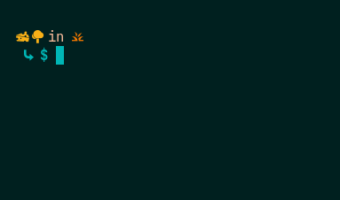
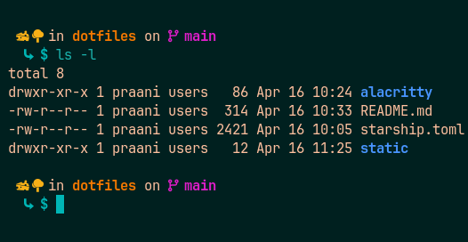

# Introduction
- Requirements: [Nerd-Font Tools](https://www.nerdfonts.com/), [Alacritty](https://alacritty.org/) and [Starship](https://starship.rs/) 
- This repository contains the starship and alacritty config files used on my system.
- Put the files in the following locations:
```
# alacritty.toml
${HOME}/.config/alacritty

# Theme
${HOME}/.config/alacritty/themes/themes/marine_dark_custom.toml

# starship.toml
${HOME}/.config
```

# Preview


