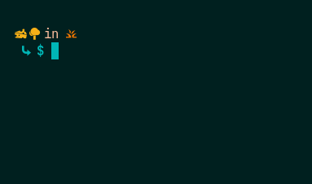
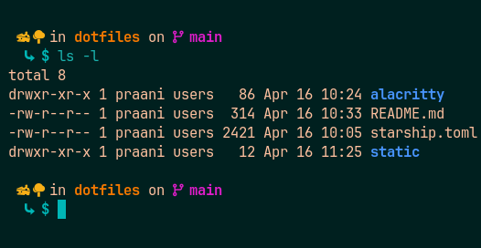

# Introduction
- Requirements: [Nerd-Font Tools](https://www.nerdfonts.com/), [Kitty](https://sw.kovidgoyal.net/kitty/binary/) and [Starship](https://starship.rs/) 
- This repository contains the starship and kitty config files used on my system.
- Put the files in the following locations:
```
# kitty.conf
${HOME}/.config/kitty/kitty.conf

# starship.toml
${HOME}/.config/starship.toml
```

# Preview
<br>
<sub>*Fig. 1: Home*</sub>

<br>
<sub>*Fig. 2: Git and Text Rendering*</sub>
